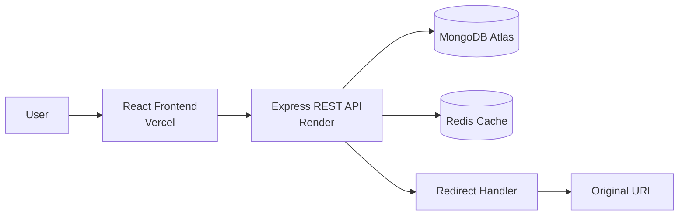

# URL Shortener App

A full-stack URL shortener built with React, Express, and MongoDB.

This project allows users to shorten links, optionally set custom aliases and expiration dates, and view basic analytics for their links.

## Live Demo

- Frontend: https://linkflow-url-shortener.vercel.app
- Backend health check: https://linkflow-url-shortener.onrender.com/api/health

## Features

- Shorten long URLs into cleaner links
- Optional custom aliases
- Optional expiration dates
- User authentication with JWT
- Click tracking and basic analytics
- QR code generation

## Tech Stack

- Frontend: React + Vite
- Backend: Node.js + Express
- Database: MongoDB
- Cache: Redis

## Architecture



## Request Flow

1. The frontend sends a long URL to the Express API.
2. The API validates the URL and generates a unique short code.
3. MongoDB stores the original URL, ownership, expiration, and click count.
4. Redis caches active URLs for faster redirects and supports rate limiting.
5. When a short link is opened, the API records the click and redirects to the original URL.

## Data Model

- `User`: stores email, password hash, display name, and account creation time.
- `Url`: stores the original URL, short code, custom alias, owner, expiration, status, and click count.
- `Click`: stores timestamp, referrer, country, browser, operating system, and device information.

## Design Decisions

- JWT authentication keeps protected dashboard requests stateless.
- Guest users can create short links, while authenticated users can manage their own links and analytics.
- Redis reduces repeated database lookups and helps protect public endpoints with rate limits.
- The frontend and backend are deployed separately so each can be built and scaled independently.

## Local Setup

### Backend

```bash
cd backend
npm install
npm run dev
```

### Frontend

```bash
cd frontend
npm install
npm run dev
```

## Environment Variables

Create `.env` files in the backend as needed for:

- `MONGODB_URI`
- `JWT_SECRET`
- `PORT`
- `FRONTEND_URL`
- `BASE_URL`

## Notes

This application is designed to be a standalone project and can be adapted for your own deployment and branding.

## Deployment

The frontend is deployed on Vercel and the backend is deployed on Render.

### Vercel

Deploy the `frontend` directory with:

```bash
npm run build
```

Use `dist` as the output directory.

### Render

Deploy the `backend` directory as a Node.js Web Service with:

```bash
Build Command: npm install
Start Command: npm start
```

Configure these environment variables on Render:

```text
NODE_ENV=production
MONGODB_URI=your MongoDB connection string
JWT_SECRET=your secure secret
FRONTEND_URL=https://linkflow-url-shortener.vercel.app
BASE_URL=https://linkflow-url-shortener.onrender.com
```
